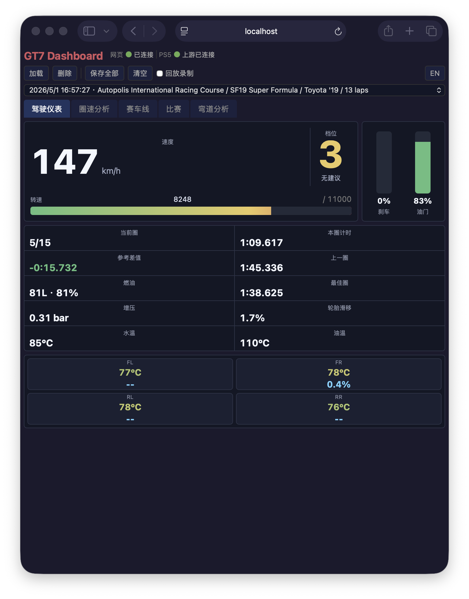
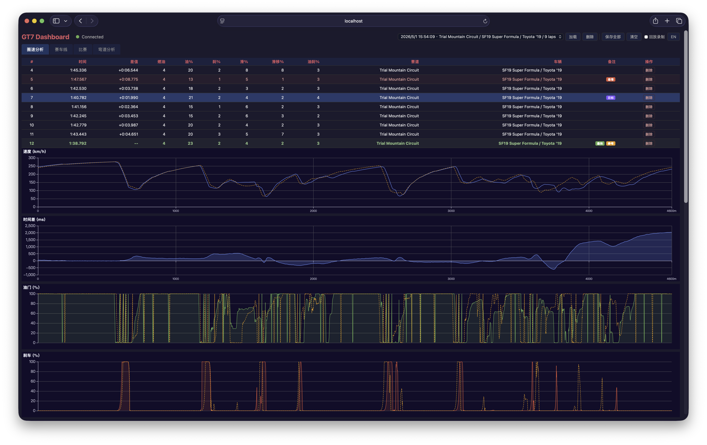
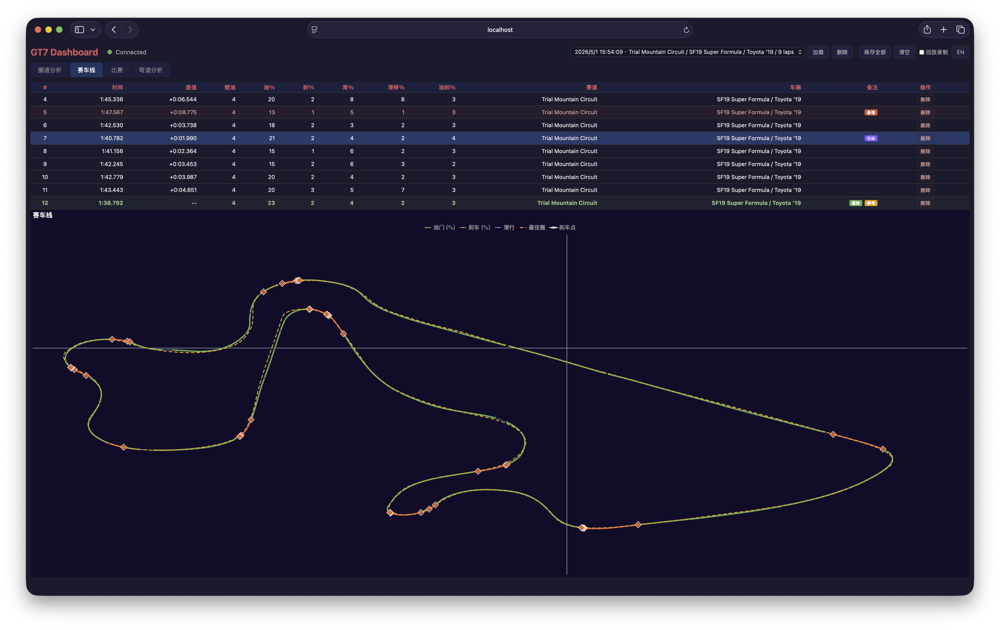
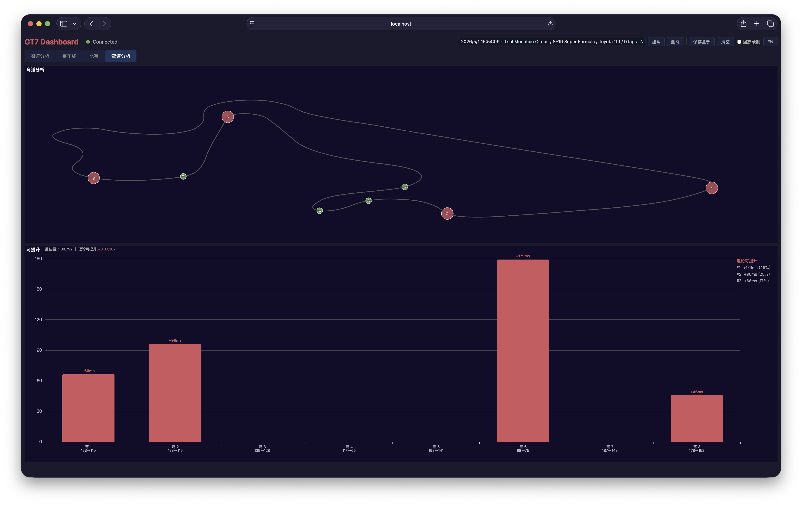

# GT7 Dashboard

GT7 实时遥测看板，用于查看圈速、速度、油门、刹车、轮胎滑移、时间差、赛车线、燃油和弯道分析。

## 运行

```bash
make run
```

## 编译

```bash
make install
```

前端始终 embed 到二进制中。

## 字段说明

- `差值`：当前圈速相对本批数据最快有效圈的时间差。
- `燃油`：该圈消耗燃油，按圈开始和结束燃油量计算。
- `油%`：全油门 tick 占该圈总 tick 的比例。
- `刹%`：全刹车 tick 占该圈总 tick 的比例。
- `滑%`：油门和刹车都为 0 的滑行 tick 比例。
- `滑移%`：轮胎滑移超过阈值的 tick 比例。
- `油刹重叠%`：油门和刹车同时输入的 tick 比例；数值越高，说明同一时间踩油门和刹车越多。
- `赛道`：该圈识别到的赛道名称；没有名称时回退到赛道 ID。
- `车辆`：遥测里的车辆名称。
- `备注`：最快圈、最慢圈、参考圈、目标圈、进站圈等标记。

## 按钮流程

- `回放录制`：开启后，回放中的完成圈才会写入历史圈；关闭时只预览当前回放圈。
- `加载`：从下拉选择一个已保存 JSON，加载后会替换当前 `laps.json`，并做去重。
- `删除`：删除下拉当前选择的已保存 JSON 文件，不影响当前 `laps.json` 和 `current_lap.jsonl`。
- `保存全部`：把当前所有完成圈保存到同一个 JSON 文件；保存后清空当前圈、历史圈、`laps.json` 和 `current_lap.jsonl`。
- `清空`：只清空当前圈、历史圈、`laps.json` 和 `current_lap.jsonl`；不会删除已保存 JSON。
- 表格里的 `删除`：删除单圈完成圈，并立即保存到 `laps.json`。

保存文件名格式为 `YYYYMMDD_HHMM__赛道__车辆.json`。文件名基于当前完成圈里最早一圈的开始时间生成；加载后继续录制再保存，会覆盖同一个文件。

## 截图








